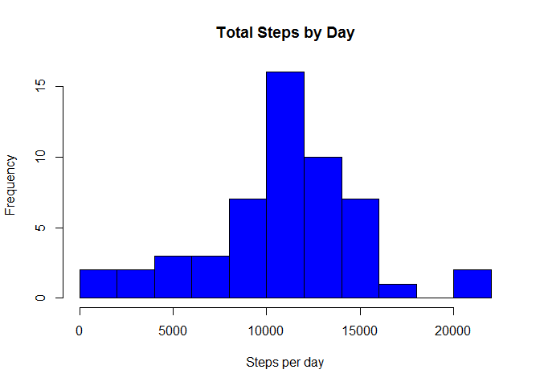
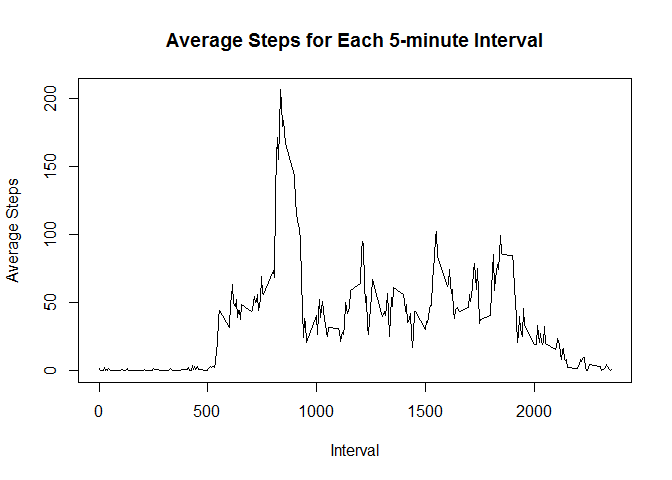
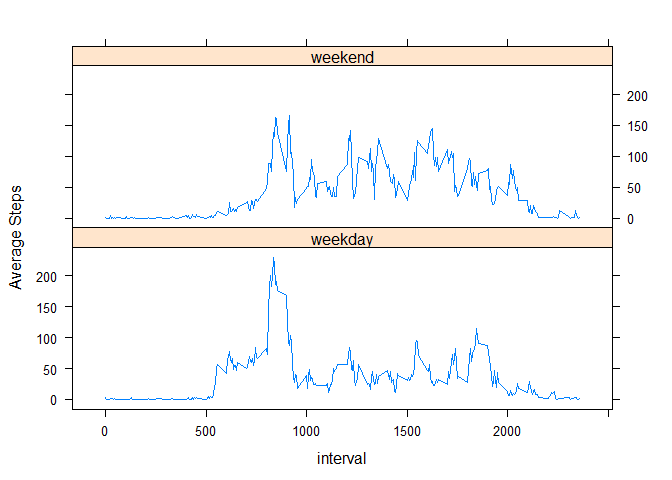

Activity Monitoring Analysis
============================

Reproducible Research - Project 1
---------------------------------

author: Roberto Garuti

Load the packages needed for the analysis and the data from the working
directory

    library("dplyr", lib.loc="~/R/win-library/3.3")
    library("lattice", lib.loc="C:/Program Files/R/R-3.3.2/library")
    stepdata <- read.csv("activity.csv", header = TRUE)

Calculate the total number of steps recorded in each day and plot it on
an histogram

    dailysteps <- aggregate(steps~date, stepdata, sum )
    hist(dailysteps$steps, main = "Total Steps by Day", xlab = "Steps per day", breaks = 10, 
         col = "blue")

Calculate the mean value for the steps recorded in each day

    dailymean <- mean(dailysteps$steps, na.rm = TRUE)
    dailymean

    ## [1] 10766.19

Calculate the median value for the steps recorded in each day

    dailymedian <- median(dailysteps$steps, na.rm = TRUE)
    dailymedian

    ## [1] 10765

Calculate the mean value for the number of steps taken in each 5-minute
interval averaged across each day and plot the result in a time series
graph

    intervalsteps <- aggregate(steps~interval, stepdata, mean )
    plot(intervalsteps$interval, intervalsteps$steps, type = "l", xlab = "Interval", 
         ylab = "Average Steps", main = "Average Steps for Each 5-minute Interval")

The interval corresponding to 8:35 is the one with the highest mean
number of steps across all days (206.1698 in 5 minutes)

    intervalsteps[intervalsteps$steps == max(intervalsteps$steps),]

    ##     interval    steps
    ## 104      835 206.1698

Calculate total number of missing values in the dataset (NAs)

    length(stepdata$steps[is.na(stepdata$steps)])

    ## [1] 2304

Replace each missing value in the dataset with the corresponding average
number of steps for that 5-minute interval calculated across all days in
the previous step

    for(i in 1:nrow(stepdata)) {
      if(is.na(stepdata[i,1])) {
        y <- stepdata[i,3]
        z <- intervalsteps[intervalsteps$interval == y,2]
        stepdata[i, 1] <- z
      }
    }

Calculate the total number of steps recorded in each day and plot it on
an histogram for this new dataset with filled NAs

    dailysteps1 <- aggregate(steps~date, stepdata, sum )
    hist(dailysteps1$steps, main = "Total Steps by Day", xlab = "Steps per day", breaks = 10, 
         col = "blue")

Calculate the mean value for the steps recorded in each day for this new
dataset. This value is identical to the one calculated for the original
dataset. Filling the NAs with the selected strategy didn't affect the
mean value since the NAs were filled with daily means themselves

    dailymean1 <- mean(dailysteps1$steps, na.rm = TRUE)
    dailymean1

    ## [1] 10766.19

The same process is performed for the median value. In this case the
value slightly changes especially because the imputed values, being
averages, are not necessarily integers while the original median is
calculated based on recorded data that have integer values for the
number of steps in each 5 minute interval.

    dailymedian1 <- median(dailysteps1$steps, na.rm = TRUE)
    dailymedian1

    ## [1] 10766.19

Add a factor to the dataset indicating if the day is a weekday or a
weekend day

    stepdata$date <- as.Date(stepdata$date,"%Y-%m-%d" )
    stepdata$weekday <- weekdays(stepdata$date)
    stepdata$weekday <- as.factor(stepdata$weekday)
    stepdata[stepdata$weekday %in% c("Saturday","Sunday"),5] <- "weekend"
    stepdata[!(stepdata$weekday %in% c("Saturday","Sunday")),5] <- "weekday"
    names(stepdata)[5] <- "weekworkday"
    stepdata$weekworkday <- as.factor(stepdata$weekworkday)

Create a panel plot for the mean value of the number of steps taken in
each 5-minute interval averaged across each day, distinguishing between
weekdays and weekend days

    wkdataframe <- aggregate(steps~interval+weekworkday,stepdata,mean)
    xyplot(steps~interval|weekworkday,data = wkdataframe,layout=c(1,2), type="l",
           ylab = "Average Steps")

